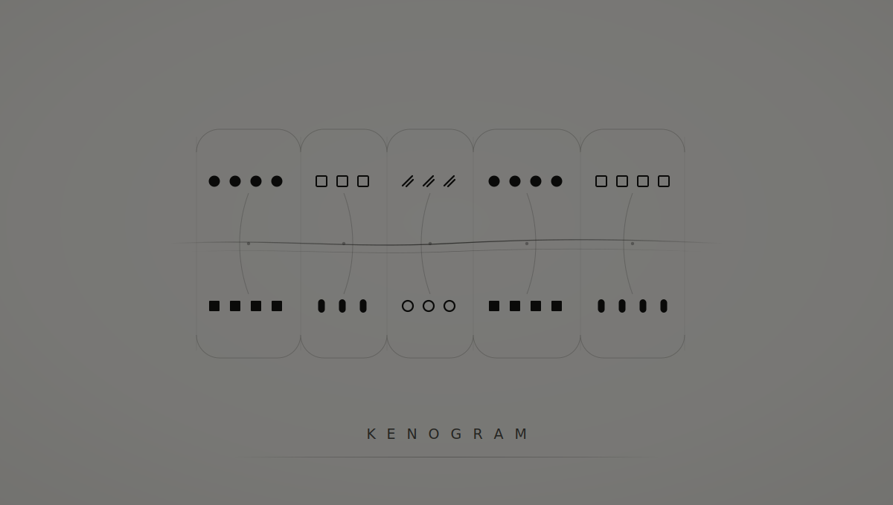

<p align="center">
  
</p>

# Kenogram

Kenogram materializes small Linux computers from a declaration. Everything
visible inside a world belongs to its inhabitant; everything else is absent
unless the declaration deliberately carries it across the boundary.

```sh
make build
./bin/kenogram up --dry-run ./kenogram.example.toml
```

The dry run is read-only; `kenogram.example.toml` is a planning/schema example,
not an apply-ready world. Before start, the materialized world must provide
`/usr/bin/tail`, `/bin/sh`, the declared user, and every declared service
binary; executables may come from the base or declared copies. Normal
`kenogram enter` also expects `/usr/bin/tmux` and a `main` session;
`enter --repair` needs only `/bin/sh`.

After authoring and dry-running a real declaration, the lifecycle follows this
illustrative sequence:

```sh
./bin/kenogram up --yes ./world.toml
./bin/kenogram status engineering
./bin/kenogram enter engineering       # or: ./bin/kenogram enter --repair engineering
./bin/kenogram down engineering
./bin/kenogram up --yes ./world.toml   # restart or reconcile
./bin/kenogram destroy --yes engineering
```

Replace `engineering` with the declaration's name. Durable state lives
under `$XDG_DATA_HOME/kenogram/worlds` (normally
`~/.local/share/kenogram/worlds`); tests and automation may set
`KENOGRAM_STATE_DIR`.

The contracts in [`requirements/`](requirements/) are binding. Their
[evidence table](requirements/INDEX.md#evidence-and-open-boundaries) separates
what is proven from what remains open. See the [declaration
schema](requirements/declaration.md), [operations and
recovery](requirements/operations.md), and [contributor contract](CONTRIBUTING.md).

The name is a deliberate but limited adaptation of Rudolf Kaehr's
kenogrammatics: the project privileges observable patterns over the identity of
their realization, without claiming to implement a morphogrammatic calculus.
[`docs/kenogrammatics.md`](docs/kenogrammatics.md) records that lineage, the
engineering analogy, and its limits.

Kenogram is pre-release and uses the Go standard library exclusively. Its
proven runtime is Linux; it requires
rootless Podman on cgroups v2, `nsenter`, and configured subordinate UID/GID
ranges. `make integration` verifies the real namespace boundary; it is mandatory
in CI and intentionally fails rather than weakening isolation when those host
prerequisites are absent.

An [experimental Apple container-machine launcher](docs/apple-container-machine.md)
can forward the complete Linux operation from macOS into an operator-managed
machine. It preserves the Podman checks rather than treating Apple's container
CLI as an equivalent isolation backend. The launcher is unit-tested and
cross-compiled, but still needs real Apple-silicon proof before release support.

`make e2e` runs the release-pinned composition proofs. Kenogram isolates
OpenClaw `2026.6.11` with deterministic fake Telegram and model services,
Hermes Agent `v2026.7.7.2` with the same hermetic boundaries, and accepts the
Engram `v0.3.0` release. Separate proofs cover each agent's native Telegram
path and fake-Telegram → Engram → tmux → agent path. Pull requests require
both isolation and Engram composition proofs.

The operator-assisted `make e2e-telegram-canary` is deliberately separate. It
uses a protected canary bot to prove the real Telegram path and never runs on a
pull request. Exact commands and secret requirements are in
[`CONTRIBUTING.md`](CONTRIBUTING.md#composition-proofs). Security reports belong
in GitHub's private vulnerability-reporting flow.
